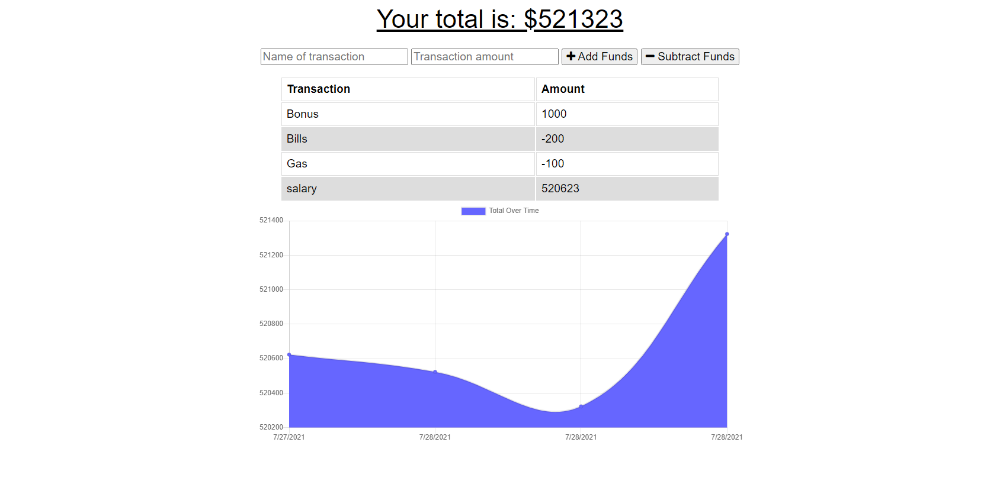

# Online/Offline Budget Trackers

<h2> Table of Contents </h2>

- [Project Link](#project-link)
- [Description](#description)
- [User Story](#user-story)
- [What did we do](#what-did-we-do)
- [Screenshots](#screenshots)

## Project Link

Click [here](https://github.com/PDUBB3/budget-tracker.git) to view project on Github repository.
Click [here](https://dry-fortress-37968.herokuapp.com/) to view project on Heroku

## Description

In this project, I have added functionality to our existing Budget Tracker application to allow for offline access and functionality.

The user will be able to add expenses and deposits to their budget with or without a connection. When entering transactions offline, they should populate the total when brought back online.

Offline Functionality:

- Enter deposits offline

- Enter expenses offline

When brought back online:

- Offline entries should be added to tracker

## User Story

AS AN avid traveller
I WANT to be able to track my withdrawals and deposits with or without a data/internet connection
SO THAT my account balance is accurate when I am traveling.

## What did we do?

I have created a budget tracker,where in a situation where I am able to do the following:
WHEN the user inputs a withdrawal or deposit
THEN that will be shown on the page, and added to their transaction history when their connection is back online.

- [x] GIVEN a user is on Budget App without an internet connection
      WHEN the user inputs a withdrawal or deposit
      THEN that will be shown on the page, and added to their transaction history when their connection is back online.

## Getting started

- Create a new GitHub repository called budget-tracker
- Clone github project onto your local machine
- Navigate into the project
- Open the project into VS code

```
git clone git@github.com:PDUBB3/budget-tracker.git
cd readme-generator
code .
```

- Repo to include a `package.json` file by running `npm init -y` when you first set up the project.
- Add `start` script to `package.json`
- Create a `seed.sql` file to pre-populate our database
- Use `scheme.sql` filed in the `db` folder to create database with MySQL commands and use environmental variables to store sensitive data.

Installation

```
npm i


```

Run

```
npm run start


```

## Screenshots


